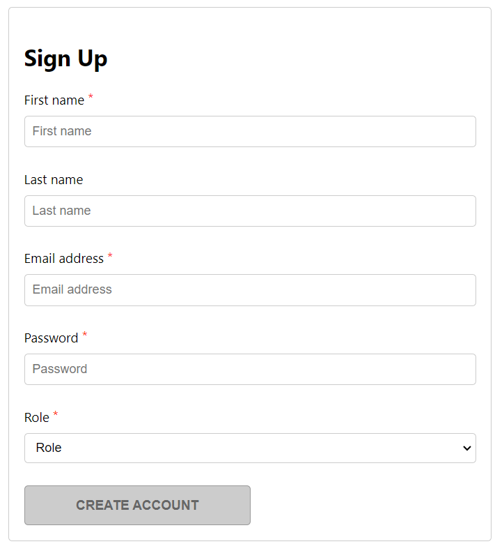

# Formulário de Criação de Cadastro

O seguinte programa foi desenvolvido utilizando como base o curso **Advanced React** através do **Certificado Profissional Meta Front-End Developer**. 

## Objetivo

Seu objetivo foi a criação de um formulário de cadastro que tivesse as seguintes características:

* Impedir que o usuário pudesse validar o formulário sem que todos os campos obrigatórios fossem preenchidos;
* Utilizar um aviso de erro para o caso da senha estar incompleta;

## Conceitos Utilizados

Para a criação deste projeto, foram utilizados:

* Conhecimentos de `REACT`, UseState e componentização
* Conhecimentos de form utilizando `HTML` e `CSS`
* Lógica de programação dentro do `JS`  

## Imagem Demonstrativa

